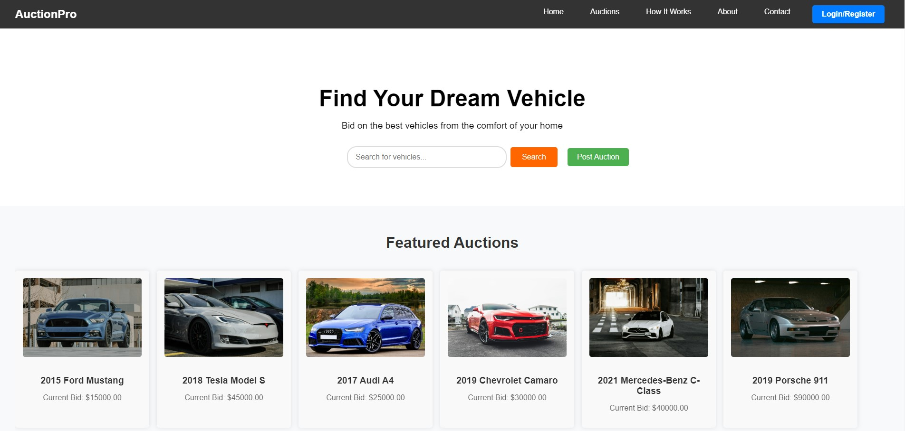
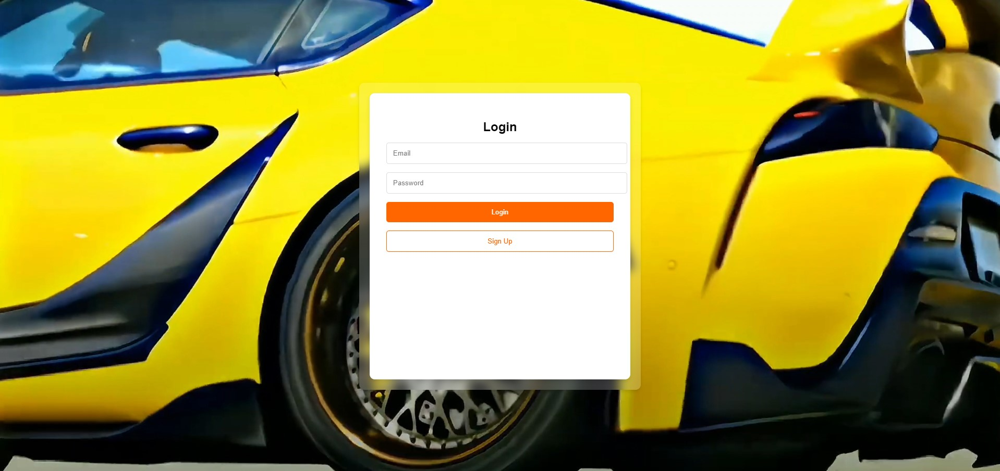
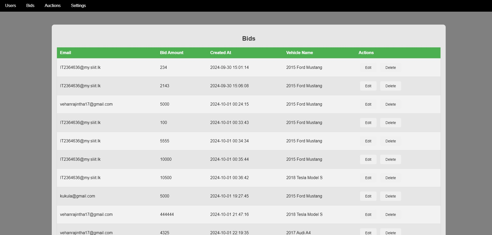
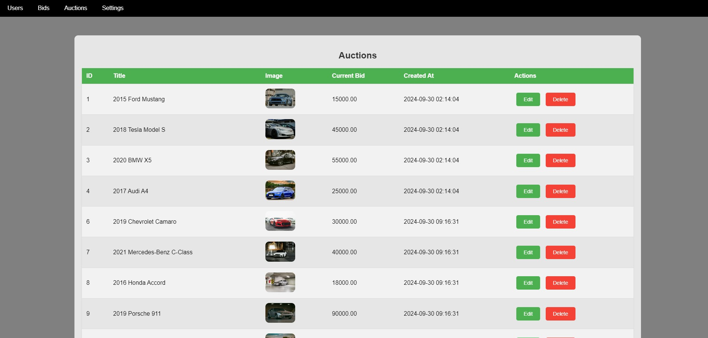
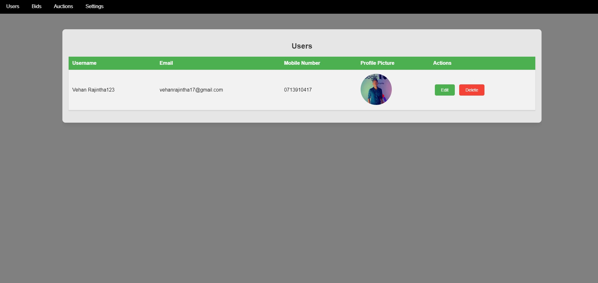
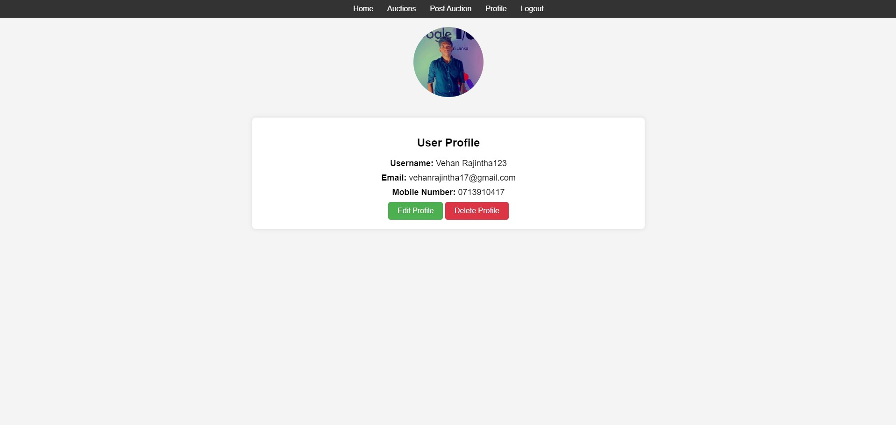

# Vehicle_Auction_System

--------------------------------------------------INSTRUCTIONS--------------------------------------------------------------

**Install xampp**
- Run apache and MySQL servers through xampp
- Put the project folder to /xammp/htdocs path
- create Databse on PhpMyAdmin dashboard name --> vehicle_auction
- import database ---> _vehicle_auction.sql
  

- Open your browser and browse http://localhost/Auction_System/ (this is the main user page)
- Admin and manager login page --------->  http://localhost/Auction_System/admin/

Sample User login credential : E-mail ----> vehanrajintha17@gmail.com
                               password---> 234

Admin login credential       : email ---> admin@gmail.com
                               password ----> 123

**extra**      
            ----> Used bind values for php 
		         (The bindValue method is used to bind a value to a parameter in a prepared statement. This helps prevent SQL injection   attacks by ensuring that the values are properly escaped.)
            ----> Used Session management 

## Download
# Click on the below Mediafire icon to Download Full Zip file with Database

## Screenshots

